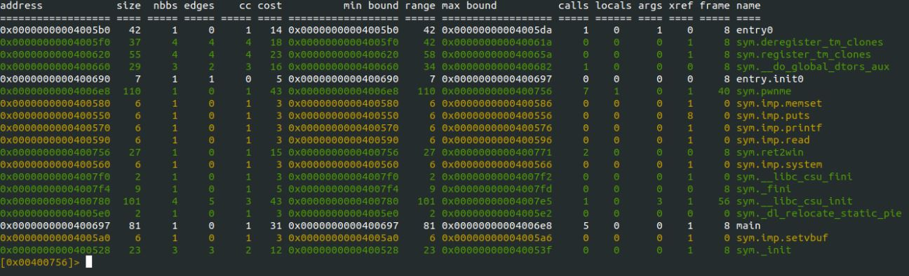
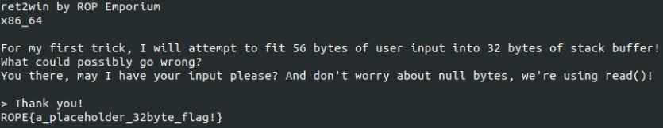

---
layout:
  title:
    visible: true
  description:
    visible: false
  tableOfContents:
    visible: true
  outline:
    visible: true
  pagination:
    visible: true
---

# Ret2Win

## X86\_64

#### Filling the buffer

* Using python to generate strings we can determine the size of the buffer we are targeting&#x20;
* By adjusting the number of characters in the string generated we can find how many characters we need to overflow the buffer `python -c 'print("A"*X)'` where x = the size of the buffer&#x20;
* In this example we can determine that the buffer size is 40 bytes This information can be used to create the padding for the ROP string

#### Targeting the function

* The next step is determining the address of the function that we are trying to execute&#x20;
* Using radare2 we can dump the functions of the program using the command _afl_ in radare2

<figure><figcaption><p>Functions listed using radare2</p></figcaption></figure>

* This will result in a few interesting results such as _**ret2win**_ and _**pwnme**_
* In this challenge we will be targeting the _**ret2win**_ function to dump the contents of a file containing the flag&#x20;
* Changing the memory address in radare2 to the address of ret2win by using the s command in radare2

#### Creating the exploit

* Using the information gathered a ROP string can be created to dump the contents of flag.exe
* Combining the Padding of 40 bytes and the memory address will yield a working ROP string

```
AAAAAAAAAAAAAAAAAAAAAAAAAAAAAAAAAAAAAAAA 0x64 0x07 0x40 0x00 0x00 0x00 0x00 0x00 0x00
```

* Python is able to print raw hex bytes to the terminal, this will allow the program to read the string as hex instead of their ascii representation

```
python -c 'print("A"*40 + "\x64\x07\x40\x00\x00\x00\x00\x00\x00")'
```

* Piping the output of this to the program to the program will dump the contents of flag.txt

<figure><figcaption><p>Successful exploit</p></figcaption></figure>

#### Exploit code

* Run python within a line: python -c '
* Print characters to output ROP string: print(
* Create a buffer of 40 Bytes: "A" \* 40
* Append string to the buffer: +
* Memory address of function in LSB: "\x64\x07\x40\x00\x00\x00\x00\x00\x00")'
* Pipe ROP string to the program: | ./ret2win
