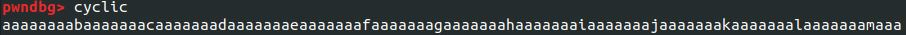
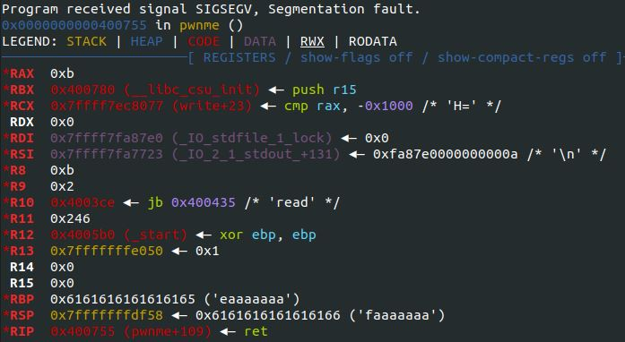
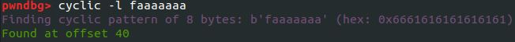
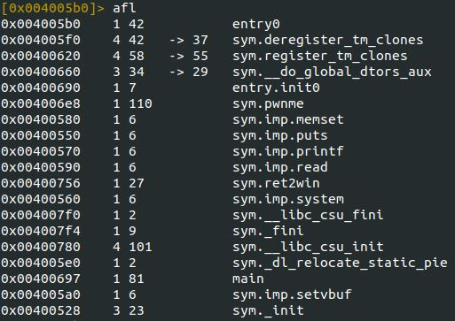
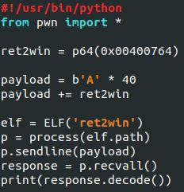
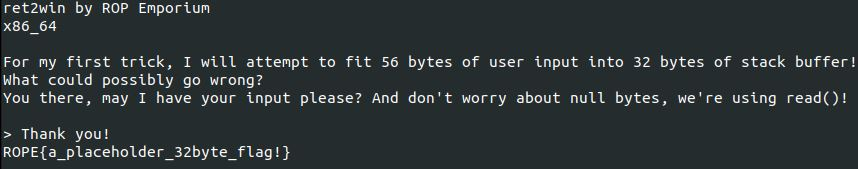

---
layout:
  title:
    visible: true
  description:
    visible: false
  tableOfContents:
    visible: true
  outline:
    visible: true
  pagination:
    visible: true
---

# Ret2Win

## X86\_64

#### Determining the buffer size with cyclic

The first step in writing a ROP string is determining the buffer size of the program we're targeting. This can be achieved by generating a pattern string to calculate the size of the buffer. In this case, I used the cyclic command located within pwndbg. Pwndbg is a GDB plugin that makes exploit development easier. When running this command, it will output a string with distinct sections that can be sent to the command again to calculate the size of the buffer.

<figure><figcaption>
Output of cyclic command
</figcaption></figure>

Running the program in pwndbg and using the string generated with pwndbg will crash the program. Once the program crashes, pwndbg will automatically show the registers at the time of the crash. This is used to help troubleshoot the ROP chain; here, we'll look at the value of the RSP register to determine the length of the buffer.

<figure><figcaption>
Crashed program registers
</figcaption></figure>

Now that we have the value of RSP at the time of the crash, we can use that to calculate the size of the buffer. We do this by sending the value back to the cyclic command with the -l flag to locate the string.

<figure><figcaption>
Calculating the length of the buffer
</figcaption></figure>

#### Locating function with r2

With the size of the buffer known, we can now control the program execution; the next step is to locate the ret2win function. This can be done using radare2 by listing the functions in the program using the "afl" command within radare2.

<figure><figcaption>
ret2win functions
</figcaption></figure>

#### Building payload with pwntools

The final step is to combine the information gathered about the program to create a working ROP string. I chose to utilize the pwntools framework to simplify the process; pwntools features a few quality-of-life functions to make building and running ROP exploits slightly easier. One of the functions used to make building ROP strings easier is p64(), this function will take a hex address and pack it into a 64-bit LSB address. Another quality-of-life feature that pwntools has is the ability to load, run, and pass arguments to a program. The script starts by importing pwntools and defining the location of the ret2win function using p64(). Next, the ROP chain is built. First, the buffer is filled with 40 "A"s, and then the location of the ret2win function is added to force the program to call ret2win. Lastly, the program is loaded, the payload is sent, and the response is received and decoded.

<figure><figcaption>
Exploit used
</figcaption></figure>

Running this script will output the flag to the terminal.

<figure><figcaption>
Successful exploit
</figcaption></figure>
