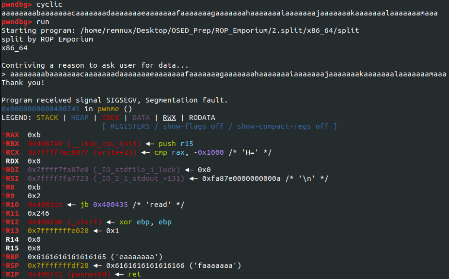
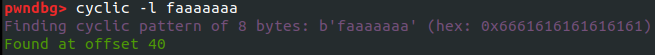
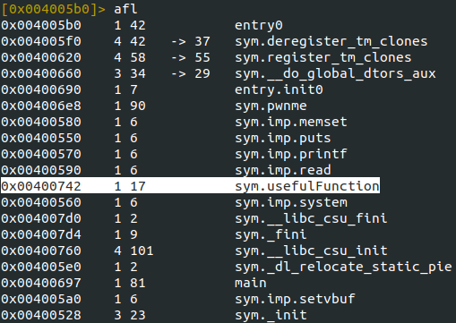
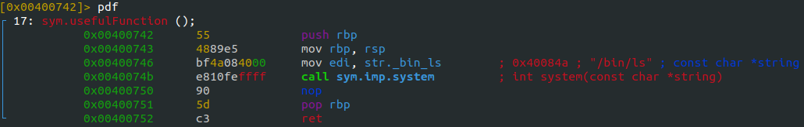
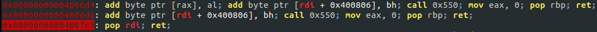
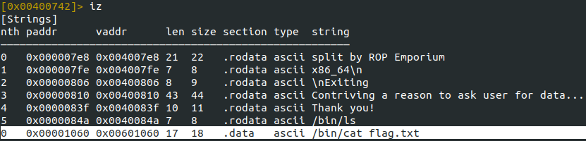
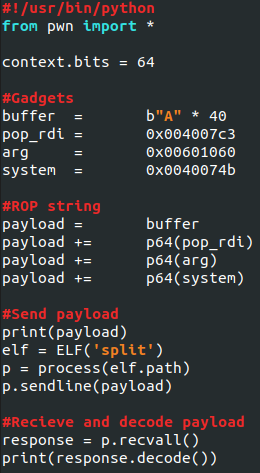
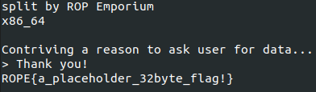

# Split

## X86\_64

This challenge is similar to ret2win, but instead of automatically reading the flag when called, the argument "/bin/cat flag.txt" needs to be passed to the function.

#### Determining the buffer size

Similar to the first challenge, we'll use pwndbg and cyclic to determine the size of the buffer we're targeting.

<figure><figcaption>
Determining the size of the buffer
</figcaption></figure>

<figure><figcaption>
Size of the buffer
</figcaption></figure>

#### Locating gadgets

Because this challenge requires us to pass an argument to the function, we'll have to locate a few gadgets to get this to work. We'll need to find a gadget that pops the RDI register, the location of the argument required, and the address of the function "usefulFunction."

Starting with the location of the function, you can use radare2 with the "afl" command to list all defined functions in the program.

<figure><figcaption>
usefulFunction location
</figcaption></figure>

Listing the contents of this function shows that when called, it is set to run "/bin/ls."

<figure><figcaption>
Contents of usefulFunction
</figcaption></figure>

Because of this, we'll have to pop the register RDI to call '/bin/cat flag.txt' into that register. This gadget can be located using ropper and grep for rdi. Running this gives us the address of the gadget pop rdi; ret at 0x4007c3.

<figure><figcaption>
pop RDI gadget
</figcaption></figure>

The final address we need to get is the address of the string '/bin/cat flag.txt.' By running the 'iz' command in radare2 to list all defined strings in the program, doing this gives us the address 0x601060.

<figure><figcaption>
Location of string
</figcaption></figure>

#### Creating the exploit

Combining all the gadgets that we've located will allow us to run '/bin/cat flag.txt' instead of '/bin/ls.' Starting by overflowing the buffer, then popping the RDI register. This allows us to move whatever data we want into that register; in this case, we load the address of the string '/bin/cat flag.txt.' After this, we call the address of the syscall located within the usefulFunction.

<figure><figcaption>
Exploit used
</figcaption></figure>

Running the script will output the flag to the terminal.

<figure><figcaption>
Contents of flag.txt
</figcaption></figure>
