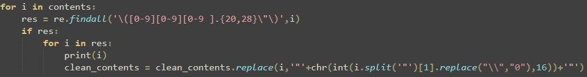

# Creating a deobfuscator

When searching for samples on MalwareBazaar, I often gravitate towards samples that have no tags so I can emulate a black box approach to whatever sample I download. More often than not, this approach doesn't yield anything too interesting, but sometimes, I stumble across an unconventional sample. This sample was one of the rare ones that didn't follow other samples and implemented its obfuscation differently.

At first glance the sample seems simple, setting a variable to an obviously obfuscated string.

<figure><figcaption></figcaption></figure>

After the string is defined, some more weird JavaScript antics are done. I don't understand the nuances of JS, so I'm not completely sure what is going on in the next screenshot. But I don't care too much. The only thing I care about is how to dump the next stage for analysis. In this case, the sample's author set "toString" to the sample's payload.

<figure><figcaption></figcaption></figure>

The next stage can be dumped by changing "toString" to a placeholder variable name, printing the variable with WScript.Echo, and commenting out the last line to prevent the sample from executing

<figure><figcaption></figcaption></figure>

Running the sample with cscript will dump the next stage to the command line where you can redirect the output to a file to save the next stage for analysis.

<figure><figcaption></figcaption></figure>

After some "beautification", the sample is still very ugly and obfuscated. This is where the true purpose of this post comes out: creating a deobfuscator to turn this mess into something readable (it's still a JS sample, so take "readable" with a grain of salt).

<figure><figcaption></figcaption></figure>

At a glance a few patterns can identified, the first one looks like a weird take on string concatenation, and the second one features some regex to build a string.

<figure><figcaption>
String Concatenation
</figcaption></figure>

<figure><figcaption>
Regex String
</figcaption></figure>

The first technique employed uses a ternary operator to determine the character in the string. If the value on the left-hand side is true the first value is set as the next character, and if the value is false the second character is set. The deobfuscator script I wrote searches for these strings using regex to find strings that start with a parenthesis followed by two to three numbers, a space, any character 20 - 28 times, then ending with "). This allows us to evaluate the expression, determine its output, and replace the obfuscated character with its deobfuscated counterpart. While looking at the sample I noticed that the expression is always true, so I took a shortcut when writing the deobfuscator and simply cut the first character and replaced it instead of evaluating the expression from Python.

<figure><figcaption></figcaption></figure>

The next technique wasn't nearly as simple to implement, requiring me to extract the string and the regex with regex. This can be broken down into two steps, finding double quote strings, then combining that with searching for "\[replace]" and extracting the string after it. After that is done, the extracted regex can be used against the string and replaced to make the sample readable.

<figure><figcaption></figcaption></figure>

This alone left some strings using this method untouched, the author implemented another layer on some of the strings. This layer used a bunch of different methods to derive the string. But, when complete they all resolve to "replace". This can be verified by creating a quick test in JS to print out one of the strings. Knowing this more regex can be used to locate large strings contained within braces

<figure><figcaption>
Obfuscated Strings
</figcaption></figure>

<figure><figcaption>
Test Script
</figcaption></figure>

<figure><figcaption>
Test Output
</figcaption></figure>

<figure><figcaption></figcaption></figure>

After all this is completed some extra cleaning is done to make the deobfuscated sample easier to read, such as removing string concatenation and removing excessive newlines. Once deobfuscated some domain names and other IOCs become apparent, searching these domains lets us identify the sample's family. This sample belongs to the bondat worm family, with very few posts about the family which I think is interesting. The sample has some anti-analysis techniques baked in and a method to self-propagate through removable media. This is the first real worm I've ever analyzed so it's pretty cool to see in a random sample from Malware Bazaar. Shoutout to https://blog.360totalsecurity.com/en/bondat-worm-struck-again-built-botnets-for-mining-cryptocurrency-and-attacking-wordpress/ for being one of the only technical writeups on the family.

<figure><figcaption>
Worm stuff
</figcaption></figure>

<figure><figcaption>
Anti-analysis
</figcaption></figure>

