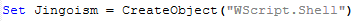
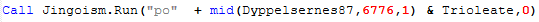
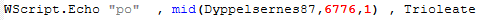
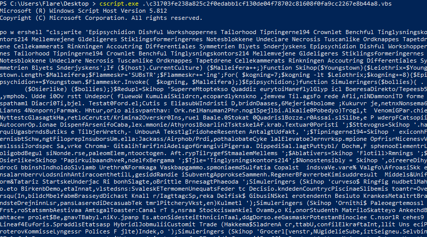
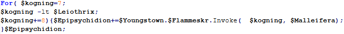
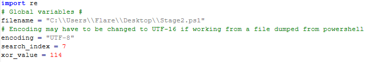
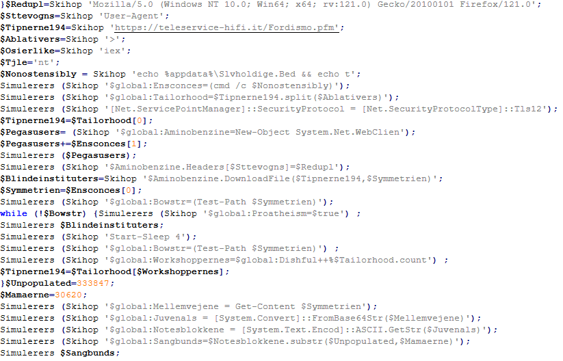

# GuLoader Script Deobfuscation

### Stage 1 - VBS

To obtain the second-stage PowerShell script, some manual work is required. Fortunately, breaking down the first stage is relatively straightforward, allowing us to extract the embedded PowerShell script.

GuLoader utilizes `wscript` for interaction with the operating system. The initial step involves locating the variable used to call `wscript`, typically identified by searching for the string "WScript".

<figure><figcaption></figcaption></figure>

Once the variable name is identified, another search helps pinpoint where it's utilized. This search should lead to a line resembling the following:

<figure><figcaption></figcaption></figure>

By modifying this line to output its contents to the command line, we can extract the second-stage script.

<figure><figcaption></figcaption></figure>

Running the modified first stage using `cscript` from PowerShell enables dumping of the second stage directly to the command line.

<figure><figcaption></figcaption></figure>

### Stage 2 - PowerShell

After dumping the PowerShell payload, the next step is to determine the substring integer needed for the deobfuscation script. This is typically straightforward; at the beginning of the PowerShell script, there's usually a function defined. Inside this function, there's a for loop initialized with a non-zero number, which serves as the substring value for deobfuscating a passed string. In the sample, this number is set to seven.

<figure><figcaption></figcaption></figure>

Once the substring value has been determined it can be configured in the python deobfuscation script.

<figure><figcaption></figcaption></figure>

Running the python script drops a deobfuscated version of the PowerShell script in the current working directory.

<figure><figcaption></figcaption></figure>

### Background information

<table><thead><tr><th width="139">Algorithm</th><th>Value</th></tr></thead><tbody><tr><td>MD5</td><td>a4163c297e14cd940d72f601f04cabbc</td></tr><tr><td>SHA-1</td><td>7be322a6b0571912ded2402cd3ac0b2312fb9c1c</td></tr><tr><td>SHA-256</td><td>c31703fe238a825c2f0edabb1cf130de04f78702c81608f0fa9cc2267e8b44a8</td></tr></tbody></table>


Link to sample

