# Clearing the Smoke: A Smokeloader Analysis Part 1

Like with most samples I work with, I avoided researching the sample's family before finishing my analysis. This allows me to simulate a "black box" approach, forcing me to analyze the sample as if it were undocumented. The purpose of this post isn't to derive new IOCs from Smokeloader but to show my methodology behind working with unknown samples. This analysis started with a JS infector found on Malware Bazaar, eventually dropping a .NET loader, which executed Smokeloader in memory. The initial stages of the infection are rather boilerplate and not worth mentioning. The only interesting technique used in the initial stages was within the .NET loader, where it ran an integrity check on its sections, determining if any sections had been tampered with. If the .rsrc section were altered, the sample would exit without infecting the host. Combined with .NET Reactor, this ensures that if an analyst were to clean the sample, the section's hash would be altered, preventing the sample from executing.&#x20;

This was relatively easy to defeat. Deobfuscating the sample and opening a clean and dirty version of the sample in dnSpy side by side allowed me to debug the dirty version while referencing the clean version's control flow. After the sample determines that the loader hasn't been tampered with, it will decrypt the section and execute it into memory. A Smokeloader binary can be extracted by dumping the memory before it loads.

<figure>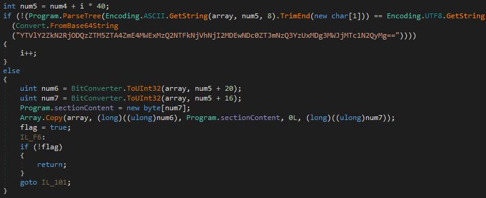<figcaption>
.NET Loader Integrity Check
</figcaption></figure>

Smokeloader can be broken down into two stages, where stage one is responsible for setting up a thread injection into explorer.exe and some anti-analysis, and stage two is responsible for setting up C2 communications and more anti-analysis. In this multistage approach, the sample can conceal its behavior more effectively than a sample that only uses one stage, executing stage two after stage one has determined the host is a valid target.

### Smokeloader Interworkings

The first stage uses two main techniques to hide its logic: opaque predicates or jump chaining, and encrypted/encoded sections. While dealing with opaque predicates in a sample is annoying, it never bothered me enough during my analysis to patch it out. But, when it came to the encoded sections, it was a little more difficult to avoid the issue altogether. To work with this, I used xdbg to dump the function's arguments and manually decoded the sample in Ghidra, allowing me to make a pseudo-clean version. This approach did have some issues with sections overlapping and tampering with each other. To get around this, most of my analysis was done using xdbg, inspecting decoded functions at runtime.

The decoder function is one of the first functions called by the loader, decoding the first section, which then in turn starts to decode other sections. The function works by taking in three arguments: the size of the section in ECX, the XOR key in DL, and the section's offset from the image base in EAX. Once called, the function will calculate where the encoded section is with the offset passed, then iterate through the section XORing each byte until it hits the end of the section passed in the size argument.

<figure>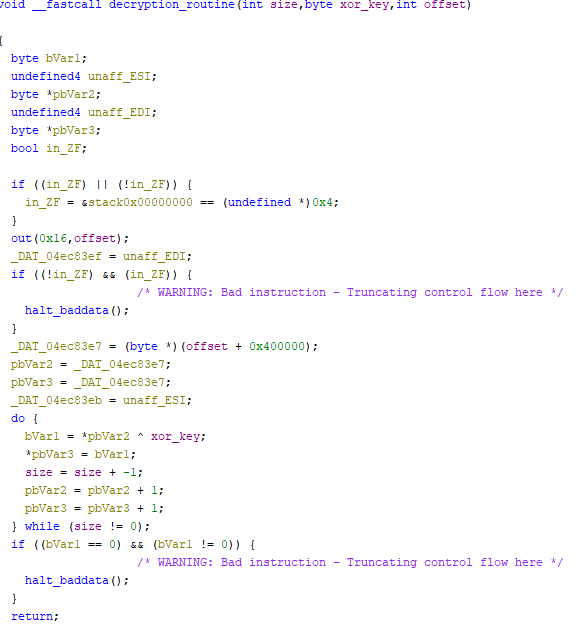<figcaption>
Decoder Function
</figcaption></figure>

After the section has been decoded, the sample will then execute the section and re-encode the section after it's finished executing. This allows the sample to avoid saving a decoded copy of itself in memory, preventing an analyst from dumping a clean sample. Another roadblock this technique introduces is the inability to set software breakpoints. Due to how software breakpoints work, any section that has one set would be clobbered with junk code, meaning I only had four hardware breakpoints at my disposal. Some crafty conditional hardware breakpoints can be used to add to the four breakpoint limit. This is cumbersome and annoying to use, so I mostly avoided using them in my initial analysis.

When debugging the sample, I used exit breakpoints to determine where the sample exited and why. This did leave some environment checks and anti-analysis techniques unseen due to my lab environment passing the check. After understanding the sample's control flow, I went back and reanalyzed the other anti-analysis sections.&#x20;

From a high level the sample checks:

&#x20;\- The keyboard layout&#x20;

\- The Registry

&#x20;\- Running processes&#x20;

\- The filesystem

One of the first things the sample has to do is manually import the APIs it's planning on using. Not straying from the status quo, this sample implements a pretty basic API hashing manual API import process. When working with API hashing, I try to avoid reversing the hashing algorithm and instead locate where the sample stores the loaded APIs and dump them from there. This allows me to save time and focus on how the sample uses the imported APIs. One cool trick I came up with is to use an xdbg script to walk the built import table and dump them automatically. The script takes in the location of the first API and the number of APIs the sample imported and uses the function's label to dump what API was imported. The number of imports can be easily found by subtracting the start of the table from the bottom of the table, minus three bytes for 32-bit samples and minus seven bytes for 64-bit samples, then dividing by 4 or 8 depending on whether the sample is 32 or 64-bit. Luckily, I don't live in either of those countries, so I don't have to worry about those checks killing the sample.

<figure>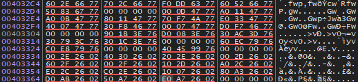<figcaption>
Import Table
</figcaption></figure>

<figure>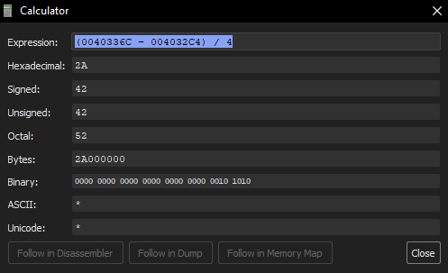<figcaption>
Calculating Number of Imports
</figcaption></figure>

<figure>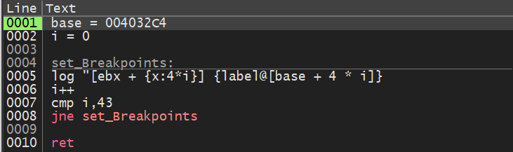<figcaption>
xdbg Script
</figcaption></figure>

<figure>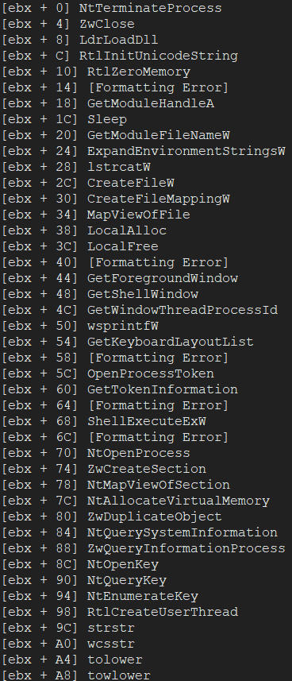<figcaption>
Imported APIs
</figcaption></figure>

After building its import table, the sample starts to run some anti-analysis routines, starting with checking if the input locale is Russian or Ukrainian using GetKeyboardLayoutList. If the host's locale is neither, the sample will continue execution.

<figure>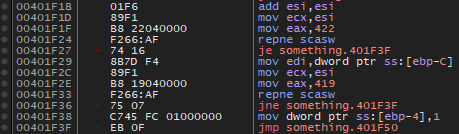<figcaption>
Locale Check in xdbg
</figcaption></figure>

<figure>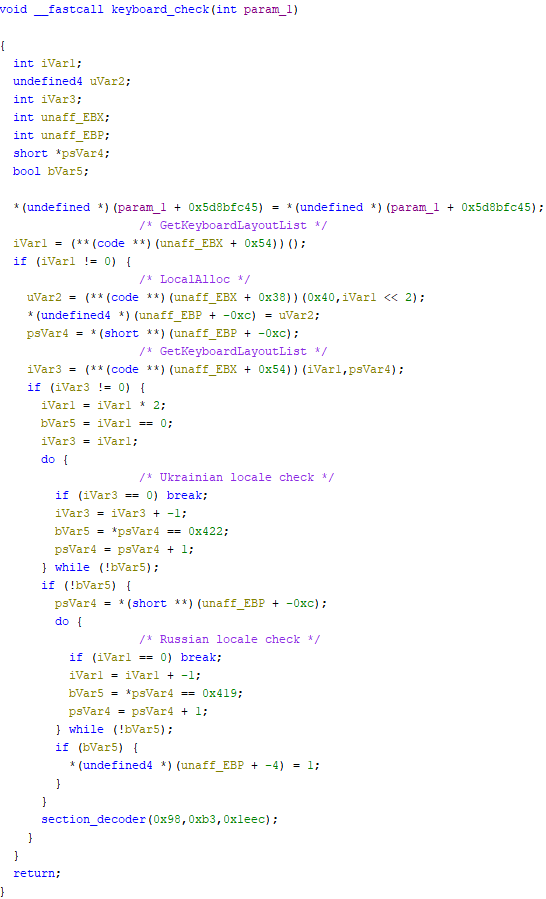<figcaption>
Decompiled Locale Check
</figcaption></figure>

Another thing of note is that at the end of the Ghidra decompilation, you can see that the section decoder is called to another section to execute, continuing the control flow.&#x20;

Once the locale check has been passed, the sample moves on to checking the registry to see if it's running in a virtualized environment. It does this by checking "\REGISTRY\MACHINE\System\CurrentControlSet\Enum\IDE" and "\REGISTRY\MACHINE\System\CurrentControlSet\Enum\SCSI" for devices containing strings "qemu", "virtio", "vmware", "vbox", and "xen". This check can be bypassed by patching the return value of NtOpenKey to any value other than 0x00. This tells the sample that there was an error opening the key, and the sample, in turn, skips the check.

<figure>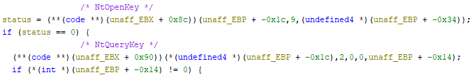<figcaption>
Registry Check
</figcaption></figure>

In my environment, the IDE key is missing, so I only had to patch the SCSI check. A hardware breakpoint can be set on this check at +0x251C to set EAX = 0x01.

<figure>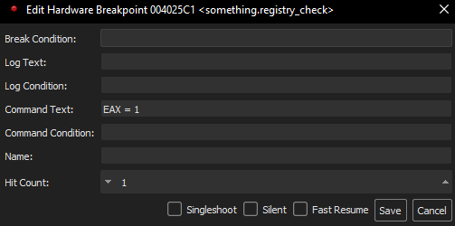<figcaption>
Hardware Breakpoint Registry Check
</figcaption></figure>

Once the registry check has been bypassed the sample then checks for processes related to virtualization. It does this by calling NtQuerySystemInformation to get a list of running processes, then calling another function responsible for comparing the list of running processes to a list of blacklisted processes. These processes include "qemu-ga.exe", "qga.exe", "windanr.exe", "vboxservice.exe", "vboxtray.exe", "vmtoolsd.exe", and "prl\_tools.exe". If one of the blacklisted processes is found running on the system the sample will terminate itself.

<figure>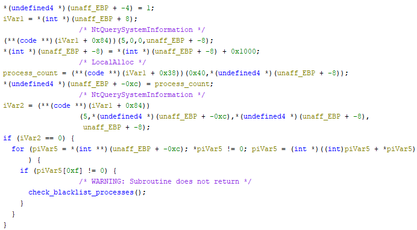<figcaption>
Process Checker Function
</figcaption></figure>

If the sample can iterate through the list of processes without finding a blacklisted process, it continues execution. I decided when working with the sample to patch the list size, telling the sample when it hits the breakpoint that there are no more processes to check. This forces the sample to continue executing without checking for any of the blacklisted processes. This was done by setting a hardware breakpoint at +0x2108 and setting the command to set \[edi] = 0.

<figure>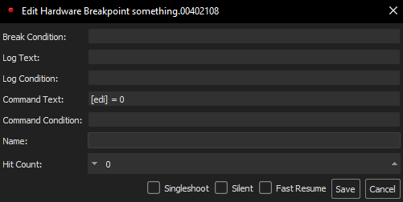<figcaption>
Process Check Hardware Breakpoint
</figcaption></figure>

Now that the process check has been defeated, the sample throws one more attempt to prevent the sample from running in a virtualized environment. This last check searches the filesystem for drivers and DLLs related to virtualization. The sample, once again, calls NtQuerySystemInformation but this time to enumerate the filesystem.

<figure>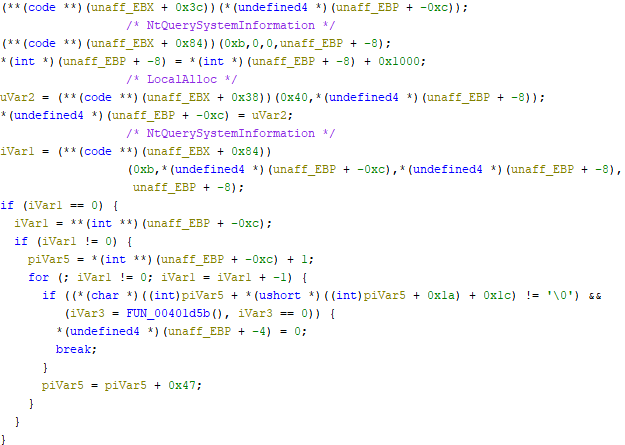<figcaption>
Process Check Decompile
</figcaption></figure>

The sample enters the loop after receiving a list of files, calling a function, which then calls the decoder function. This will then decode the section responsible for checking if the current file is in the blacklist. First, the sample will convert the current file name to lowercase and then call the checker function. The function will then iterate through a list of blacklisted files containing the entries "vmci.s", "vmusbm", "vmmous", "vm3dmp", "vmrawd", "vmmemc", "vboxgu", "vboxsf", "vboxmo", "vboxvi", "vboxdi", and "vioser". Once the checker function is finished, it calls the decoder function to re-encode itself and returns to the main loop.

<figure>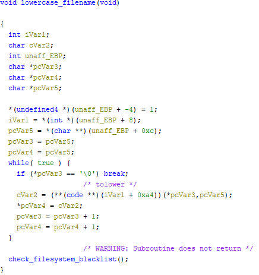<figcaption>
To Lower Function
</figcaption></figure>

<figure>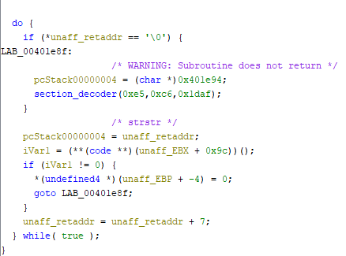<figcaption>
Compare File Names
</figcaption></figure>

Identical to the process check, I bypassed the filesystem check by setting a hardware breakpoint at +0x2282 and patched ESI = 0. Patching ESI to zero at that offset tells the sample that there are no more files to check and to continue execution.

<figure>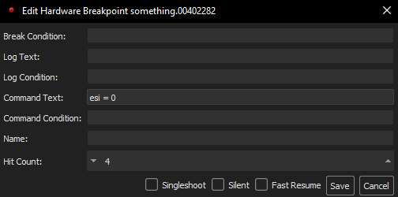<figcaption>
File System Check Hardware Breakpoint
</figcaption></figure>

After the sample has completed its environment and anti-analysis checks, it begins preparing a thread injection into explorer.exe. Because of explorer's importance on a Windows host, it's a great place to hide a payload, not only because of its reputation as a trusted process but also because it will cause stability issues on the system when a debugger is attached. This makes analyzing the sample in its target process somewhat difficult. During my initial analysis of Smokeloader, I'd often run into issues where I'd minimize the debugger window while explorer was paused, and the system would be in a deadlocked state, unable to bring the window to the foreground because explorer was paused. Because of these issues, I built a simple program that printed its PID and then jumped into an infinite loop. This created a space allowing for the Smokeloader sample to be retargeted toward the new sacrificial process.

<figure>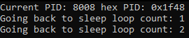<figcaption>
Sacrificial  Process
</figcaption></figure>

Setting a hardware breakpoint at +0x152B allows us to redirect the sample toward our sacrificial process by setting \[esi] equal to the PID of the new target. Now that all the anti-analysis checks have been defeated and the sample is being redirected to the new target, we're sitting at four hardware breakpoints, with no breakpoint before the sample executes the injected thread. Breaking before the sample executes the remote thread allows us to attach a debugger to the target and set a memory breakpoint on the injected memory to break on thread creation. This is where I had to get creative with making the breakpoints unset themselves when hit and activating the next one.

The last step is to pause the process before it executes the remote thread. This is done by setting a hardware breakpoint at +0x1779. Now that the next stage has been injected into the target process, the next step is to locate where the sample has allocated its payload. This can be done by RX memory that falls within 32-bit address space. Because the sample is 32-bit but targets a 64-bit process, any memory allocated from the 32-bit process has to fall within 32-bit address space. This is super useful because these two attributes are unique and easy to identify.

<figure>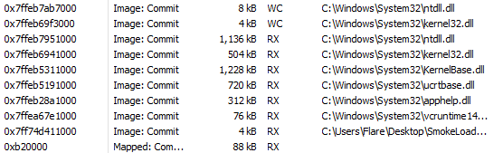<figcaption>
Sacrificial Process Loaded Memory
</figcaption></figure>

One last interesting note before discussing the second-stage payload is how the sample uses Heavens Gate to hide some of its logic before the thread executes. When first looking at the sample, I started to get very annoyed when trying to single-step into the call, and having the sample jump to some random address. I eventually discovered what Heaven Gate does and loaded the function in Ghidra as 64-bit.

That's all for stage one, due to the length of this post stage two will be discussed in the next post.
