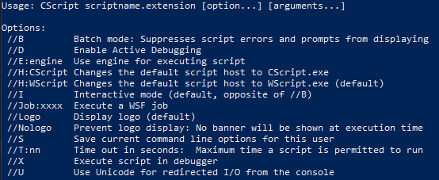
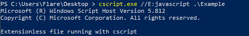
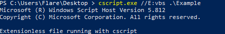
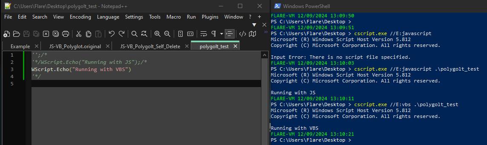
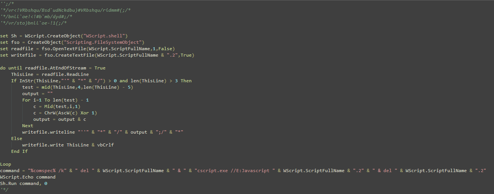
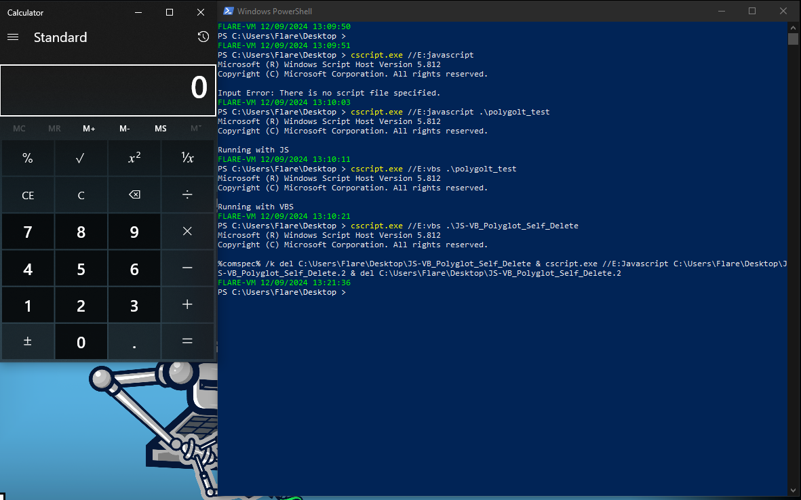

# VBS-JS Polyglot

While messing around with some JavaScript and VBS samples I stumbled across cscript's help page. Looking at the output one of the arguments looked very interesting to me, the "//E" option.

<figure><figcaption></figcaption></figure>

When cscript or wscript are run they normally parse the file name to determine what engine to run the file with, for example .js for JavaScript or .vbs for visual basic. But, with the "//E" option this can be skipped and the scripting engine can be passed as an argument.

<figure><figcaption></figcaption></figure> <figure><figcaption></figcaption></figure>

&#x20;This in itself could be very useful for bypassing command line detections looking for a specific extension, but another layer can be added to the script to further extend this technique. By abusing the way JavaScript and VBS handle comments we can create a sortof polyglot, allowing the file to be executed with the JavaScript engine or the VBS engine.

<figure><figcaption></figcaption></figure>

As you can see the sample's behavior changed from when it was run with the JavaScript engine and the VBS engine. Some ideas that I've had that could use this technique are; a sample that changes what payload is executed based on what engine it is run with, or a sample that can modify itself at execution and change languages at runtime. I created a sample that starts by running in vbs, searches for the JavaScript comment strings, XORs all the bytes in the string with 0x1, replaces them, then executes the next stage, executes calc.exe while deleting itself and it's parent.

<figure><figcaption></figcaption></figure> <figure><figcaption></figcaption></figure>

While it's not the most elegant sample, it's sufficent for a proof of concept
