# Operation Duck Hunt

On August 29th, 2023 the Department of justice announced that in a collaborative effort involving France, Germany, the Netherlands, the UK, Romania, Latvia, and the FBI they were able to successfully takedown Quakbot's infrastructure. This operation was able to identify and remediate over 700,000 hosts internationally.

When initially analyzing the sample used in Operation Duck Hunt by the FBI to take down Qakbot, there's a lack of evident signatures to identify the file's nature.

Inspecting the strings within the file provides few useful results. Some identifiable strings resemble WinAPI calls.

<figure>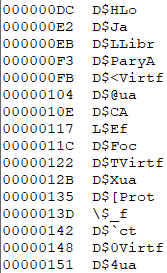<figcaption></figcaption></figure>

Opening the file in a hex editor reveals no familiar file headers or information regarding its type.

<figure>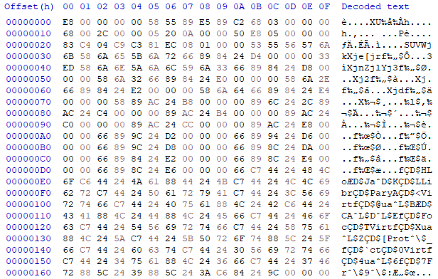<figcaption></figcaption></figure>

Running the file command on the sample classifies it as data. While this alone doesn't offer much insight into how the sample works, when combined with earlier gathered information, theories start forming about its possible nature. Since it contains strings resembling WinAPI calls and is labeled as data by the file command, it's deduced that this sample is somehow executable. However, without a known file header, the host won't be able to execute it.

Understanding that this sample is executable allows us to proceed with analysis. Using cutter to disassemble the sample reveals the mentioned strings being assembled into a memory address. Although the sample itself isn't executable, it hints at how it was deployed. Infected hosts interpreting this file as shellcode start building a list of WinAPI calls to interact with the host.

Rather than manually piecing together the assembly and strings, I opted to run the sample in a debugger and extract assembled strings from there.

<figure>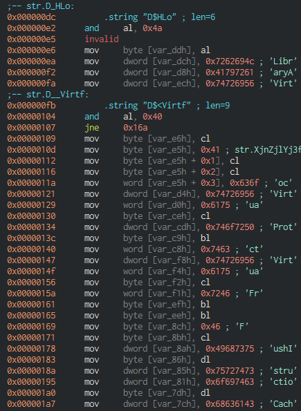<figcaption></figcaption></figure>

However, attaching it to a debugger presents a challenge. Since the file isn't inherently executable, it requires assistance to run the shellcode. This is where the tool blobrunner, developed by OALabs, comes into play. Blobrunner assists in analyzing shellcode by allocating memory for the target file and jumping to the base (or offset) of the allocated memory.

<figure>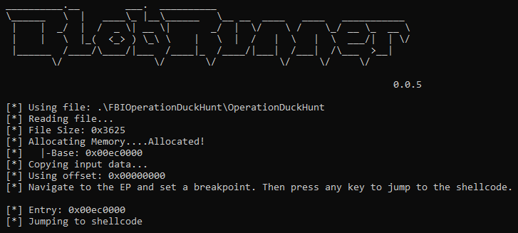<figcaption></figcaption></figure>

Using x32dbg to run blobrunner with the sample as an argument allowed setting a breakpoint on the first instruction of the shellcode and continuing to step through the sample's execution. Now running in the debugger, a breakpoint can be set on the last instruction that moves text to the stack.

<figure>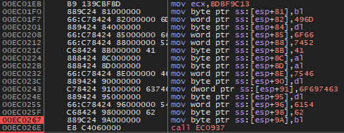<figcaption></figcaption></figure>

When the breakpoint is reached, the debugger displays the contents of the stack where the strings reside.

<figure>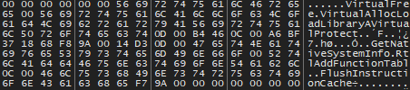<figcaption></figcaption></figure>

Retrieving the API calls used by the sample aids in understanding its actions, but the primary goal remains dumping the payload to understand its usage further.

Upon examining the built API calls, one string stands out—VirtualAlloc. This indicates the sample will allocate virtual memory during execution and load data into that block. This marks the storage location for the next stage of the sample. Setting a breakpoint at VirtualAlloc's return call pauses execution after the call is completed.

<figure>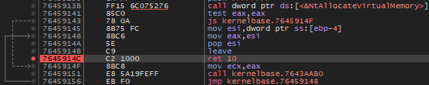<figcaption></figcaption></figure>

After the breakpoint is hit, the memory location is returned to the program in the EAX register. Now that the memory location is known, monitoring it reveals what the sample stores within it.

<figure>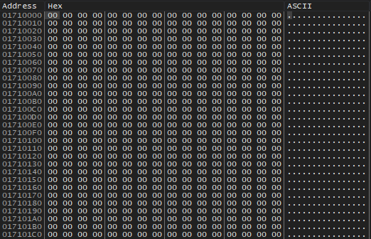<figcaption></figcaption></figure>

Immediately after the memory allocation, the sample enters a loop to move data into the allocated memory.

<figure>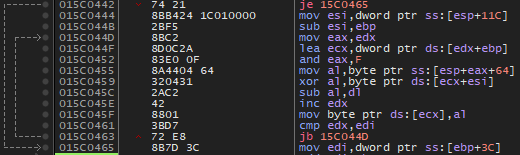<figcaption></figcaption></figure>

Upon inspecting the moved data, it becomes apparent that the sample uses the allocated memory to store an executable file, which can be dumped for further analysis in the future. As the sample makes additional calls to VirtualAlloc, the next step involves continuing through the program execution to uncover other data in memory.

<figure>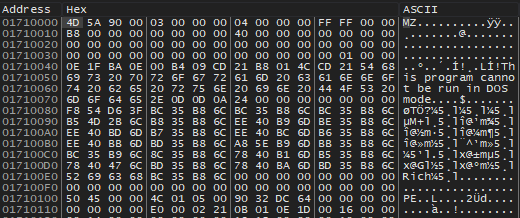<figcaption></figcaption></figure>

Continuing execution until VirtualAlloc is called again reveals another memory address, containing yet another executable. Further execution yields no more dropped files within memory.

<figure>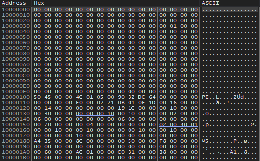<figcaption></figcaption></figure>

Now that the DLLs have been dumped, further analysis focuses on understanding how this takedown was orchestrated.

Opening the first executable dropped with pestudio reveals interesting information. The compiler timestamp is August 16th, 02:21:04z, fourteen days before it was released into the wild.

<figure>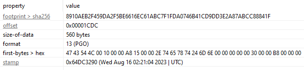<figcaption></figcaption></figure>

Locating the main function in ghidra through dllmain\_dispatch enables finding the initial function of the DLL as FUN\_10001000. This function starts by attempting to retrieve information about the running account and computer, such as the hostname and volume details. Following this, the sample creates a mutex and then establishes a named pipe using the earlier gathered information.

<figure>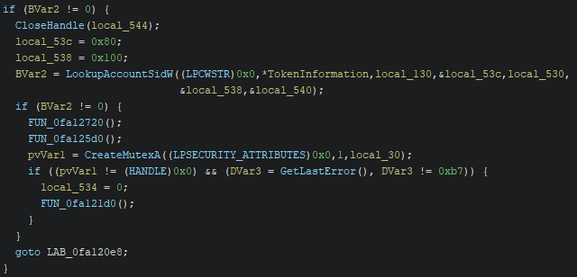<figcaption></figcaption></figure>
